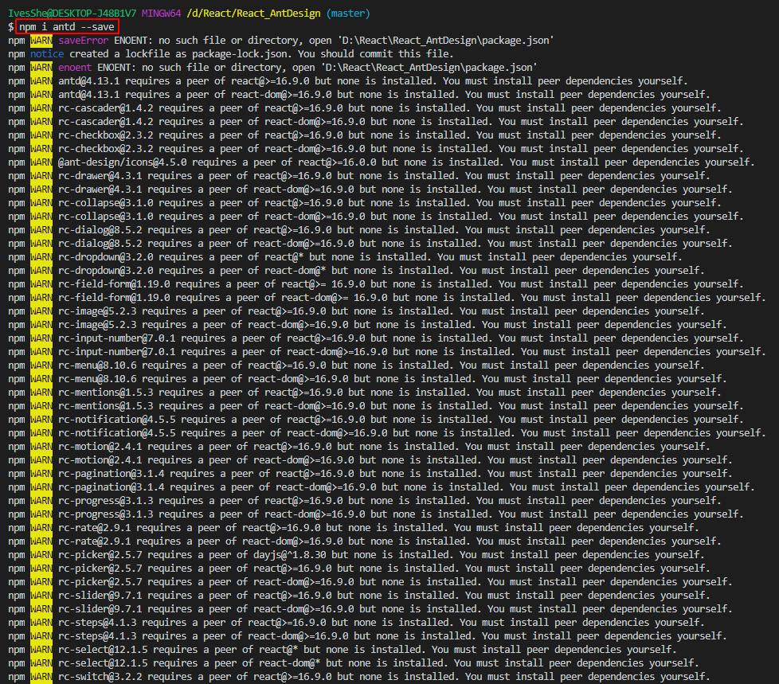
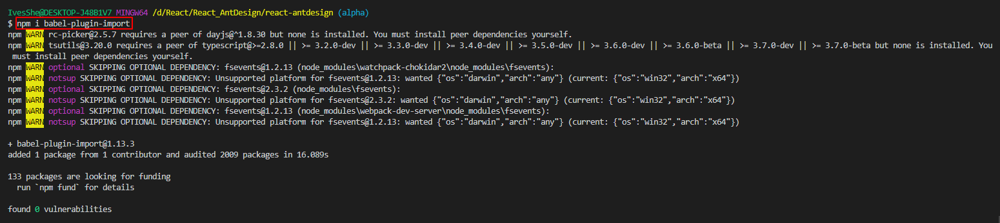

# React AntDesign

Ant Design 簡稱 antd

參考網址

https://ant.design/components/overview-cn/

# Github展示

https://ivesshe.github.io/React_AntDesign/


# 創建項目

```bash
create-react-app react-antdesign
```


# 簡化檔案結構

創建完成之後，刪除不要的檔案

最後只留四個檔案

詳細可參考之前項目

https://github.com/IvesShe/React_Router

# 安裝antd

```bash
npm i antd --save
```



# 引用

```jsx
import { Button } from 'antd';
import 'antd/dist/antd.css'
```

# 高級配置-按需求引入

切換3.x的文檔版本


查看高級配置的部分

## 補充-暴露配置(不可逆)

適合特別項目的修改

```bash
npm run eject
```


多了config及scripts資料夾


# 高級配置修改

安裝依賴庫

- react-app-rewired： 用於啟動腳手架
- customize-cra： 用於執行修改命令

```bash
npm i react-app-rewired customize-cra
```


## 修改package.json

原始

```json
"scripts": {
    "start": "react-scripts start",
    "build": "react-scripts build",
    "test": "react-scripts test",
    "eject": "react-scripts eject"
  },
```

修改為

```json
"scripts": {
    "start": "react-app-rewired start",
    "build": "react-app-rewired build",
    "test": "react-app-rewired test",
    "eject": "react-scripts eject"
  },
```


## 在項目的目錄新增config-overrides.js

```js
const { override, fixBabelImports } = require('customize-cra');

// module.exports = function override(config, env) {
//   // do stuff with the webpack config...
//   return config;
// };

module.exports = override(
  fixBabelImports('import', {
    libraryName: 'antd',
    libraryDirectory: 'es',
    style: 'css',
  }),
);
```

## 安裝babel-plugin-import

```bash
npm i babel-plugin-import
```



## 運行npm start

此時可以註解掉App.jsx的這行，無需引入完整的css了

```jsx
// import 'antd/dist/antd.css'
```

運行npm start可以正常運行

# 補充-css參考手冊

https://www.w3school.com.cn/cssref/index.asp

# antd自定義主題

## 安裝less less-loader

```bash
npm i less less-loader
```


## 修改config-overrides.js

目前為

```js
// 配置具體的修改規則
const { override, fixBabelImports } = require('customize-cra');

// module.exports = function override(config, env) {
//   // do stuff with the webpack config...
//   return config;
// };

module.exports = override(
  fixBabelImports('import', {
    libraryName: 'antd',
    libraryDirectory: 'es',
    style: 'css',
  }),
);
```

修改為(官網版)

```js
// 配置具體的修改規則
const { override, fixBabelImports, addLessLoader } = require('customize-cra');

// module.exports = function override(config, env) {
//   // do stuff with the webpack config...
//   return config;
// };

module.exports = override(
  fixBabelImports('import', {
    libraryName: 'antd',
    libraryDirectory: 'es',
    style: true,
  }),

  addLessLoader({
    javascriptEnabled: true,
    modifyVars: { '@primary-color': 'orange' },
  }),
);
```

這邊要注意，官網有坑，modifyVars現在外面要包一個lessOptions

修改為

```js
// 配置具體的修改規則
const { override, fixBabelImports, addLessLoader } = require('customize-cra');

// module.exports = function override(config, env) {
//   // do stuff with the webpack config...
//   return config;
// };

module.exports = override(
    fixBabelImports('import', {
        libraryName: 'antd',
        libraryDirectory: 'es',
        style: true,
    }),

    addLessLoader({
        lessOptions: {
            javascriptEnabled: true,
            modifyVars: { '@primary-color': 'orange' },
        }
    }),
);
```

但還是碰到報錯了

```bash
./node_modules/antd/es/date-picker/style/index.less (./node_modules/css-loader/dist/cjs.js??ref--5-oneOf-8-1!./node_modules/postcss-loader/src??postcss!./node_modules/resolve-url-loader??ref--5-oneOf-8-3!./node_modules/less-loader/dist/cjs.js??ref--5-oneOf-8-4!./node_modules/antd/es/date-picker/style/index.less)
TypeError: this.getOptions is not a function
```


上網查詢的結果是less loader的版本過高(預設裝8)

刪除本來的，安裝舊版本7的

```bash
// 卸载
npm uninstall --save less-loader
// 安装
npm install -D sass-loader@7.x
```


# 執行畫面


# Github上傳
可以參考之前的文檔

https://github.com/IvesShe/React_TodoList